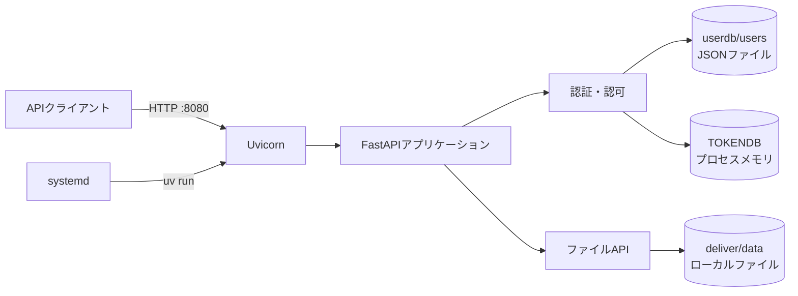
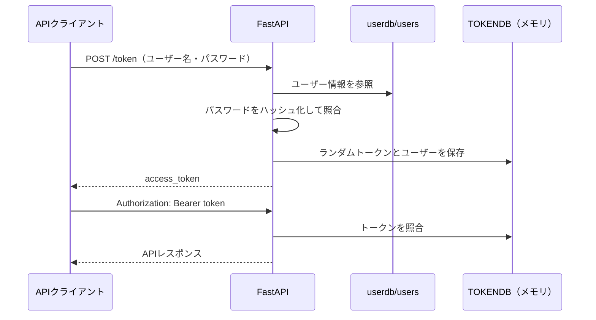

# deliver アーキテクチャ

## 目的

deliverは、stockdbで利用するデータファイルをHTTP経由でアップロード・ダウンロードするためのAPIサーバーである。

本ドキュメントでは、現在の実装に基づいてシステム構成、各コンポーネントの責務、データフローおよび設計上の制約を説明する。環境構築とsystemdへの登録手順は[README](../README.md)を参照する。

## システム構成



deliverは単一のFastAPIアプリケーションとして動作する。UvicornがHTTPリクエストを受け付け、認証・認可を行ったうえで、ローカルファイルシステム上のデータを読み書きする。

## コンポーネント

| コンポーネント | 実装・設定 | 責務 |
| --- | --- | --- |
| APIアプリケーション | `deliver/main.py` | エンドポイント、認証・認可、ファイル操作 |
| ユーザーDB | `deliver/lib_deliver.py`、`userdb/users` | ユーザー情報のJSON読み込みとパスワード照合 |
| 管理ユーザー作成 | `deliver/add_newadmin.py` | 対話形式による管理ユーザーの追加 |
| ASGIサーバー | Uvicorn | FastAPIアプリケーションの実行とHTTPリクエストの受付 |
| Python環境・依存関係 | `uv`、`pyproject.toml`、`uv.lock` | Python環境、パッケージおよびバージョンの管理 |
| プロセス管理 | systemd、`deploy/deliver.service.example` | サービスの自動起動、再起動、停止 |
| ファイルストレージ | `deliver/data/` | アップロードされたファイルの保存と配信 |

## ディレクトリ構成

```text
.
├── deliver/
│   ├── __init__.py
│   ├── main.py                 # FastAPIアプリケーション
│   ├── lib_deliver.py          # ユーザーDBの読み込みとパスワード照合
│   ├── add_newadmin.py         # 管理ユーザー作成CLI
│   ├── data/                   # 配信データ（Git管理対象外）
│   └── tmp/                    # 一時領域（Git管理対象外）
├── deploy/
│   └── deliver.service.example # systemdユニットの参考テンプレート
├── docs/
│   └── architecture.md
├── userdb/
│   └── users                   # JSON形式のユーザーDB
├── pyproject.toml
└── uv.lock
```

`deliver/data/`と`deliver/tmp/`はアプリケーション起動時に存在しなければ作成される。`userdb/`は管理ユーザー作成時、またはユーザーDB読み込み時に存在しなければ作成される。

## 起動とプロセス管理

通常運用では、systemdが`uv run`経由でUvicornを起動する。

```text
systemd
  └── uv run --frozen --no-dev
        └── uvicorn deliver.main:app --host 0.0.0.0 --port 8080
```

- `--frozen`により、起動時に`uv.lock`を更新しない。
- `--no-dev`により、JupyterLabなどの開発用依存関係を実行環境から除外する。
- systemdは異常終了時に10秒待ってプロセスを再起動する。
- UvicornはTCPポート8080で待ち受ける。

開発時はsystemdを介さず、`uv run uvicorn ... --reload`で直接起動できる。具体的なコマンドとsystemdの登録手順はREADMEに記載する。

## 認証・認可

### ユーザー情報

ユーザー情報は`userdb/users`にJSON形式で保存する。各ユーザーは次の属性を持つ。

| 属性 | 内容 |
| --- | --- |
| `username` | ユーザー名 |
| `hashed_password` | ソルトを付加してハッシュ化したパスワード |
| `salt` | Base64形式のソルト |
| `role` | `admin`、`user`、`guest`のいずれか |
| `status` | `active`または`inactive` |
| `registered` | 登録日時 |
| `updated` | 更新日時 |

パスワードは、16バイトのランダムなソルトと入力パスワードを結合し、SHA-256でハッシュ化して照合する。平文パスワードは保存しない。

### ログインとトークン



`POST /token`はOAuth2 Password形式で認証情報を受け取り、認証に成功するとランダムなBearerトークンを発行する。発行したトークンとユーザー情報は、グローバル変数`TOKENDB`に保存する。

認可はFastAPIの依存性注入を使って次の順番で行う。

1. Bearerトークンが`TOKENDB`に存在することを確認する。
2. ユーザーの`status`が`active`であることを確認する。
3. 管理者限定APIでは、さらに`role`が`admin`であることを確認する。

## APIとファイルフロー

| メソッド | パス | 必要な権限 | 保存先・取得元 |
| --- | --- | --- | --- |
| `POST` | `/token` | 不要 | ユーザー認証とトークン発行 |
| `GET` | `/logintest` | activeユーザー | 認証状態の確認 |
| `POST` | `/upload/` | admin | `deliver/data/<filename>` |
| `POST` | `/upload-kabutan-kessan/` | admin | `deliver/data/html/kabutan-kessan/<filename>` |
| `POST` | `/upload-shikiho/` | admin | `deliver/data/html/shikiho/<filename>` |
| `POST` | `/upload-shikiho-online/` | admin | `deliver/data/html/shikiho/<filename>` |
| `GET` | `/download/` | activeユーザー | `deliver/data/<filename>` |
| `GET` | `/download-kabutan-kessan/` | activeユーザー | `deliver/data/html/kabutan-kessan/kabutan_kessan.zip` |
| `GET` | `/download-shikiho/` | activeユーザー | `deliver/data/html/shikiho/<filename>` |

アップロードされたファイルとユーザーDBはローカルファイルシステムに永続化する。一方、発行したトークンは永続化しない。

## 状態とライフサイクル

| 状態 | 保存場所 | 読み込み・消失のタイミング |
| --- | --- | --- |
| ユーザー情報 | `userdb/users` | APIサーバー起動時に読み込む |
| 発行済みトークン | プロセスメモリの`TOKENDB` | APIサーバーの再起動時にすべて消失する |
| 配信データ | `deliver/data/` | ファイルを削除するまで保持する |
| 一時データ | `deliver/tmp/` | 現在のAPI処理では未使用 |

ユーザーDBは`USERDB = UserDb()`によってプロセス起動時に一度だけ読み込まれる。このため、管理ユーザーを追加・変更した後、実行中のAPIサーバーへ反映するにはサービスの再起動が必要となる。

## 現在の設計上の制約

- ユーザーDBはJSONファイルであり、複数プロセスからの同時更新を想定していない。
- ユーザー情報は起動時にのみ読み込むため、実行中にファイルを変更しても自動反映されない。
- トークンはプロセスメモリに保存され、有効期限を持たない。ただし、プロセスを再起動するとすべて無効になる。
- 複数のUvicornワーカーを起動した場合、`TOKENDB`はワーカー間で共有されない。
- パスワードの保存にはソルト付きSHA-256を使用している。パスワード専用KDFと比較すると、総当たり攻撃への耐性は低い。
- ファイル名を保存パスへ直接使用しているため、信頼できないクライアントへ公開する場合はパス検証が必要となる。
- `/upload-kabutan-kessan/`と`/upload-shikiho-online/`は保存先ディレクトリを作成しないため、事前にディレクトリが必要となる。
- ファイルはローカルディスクに保存するため、複数サーバー構成ではストレージが共有されない。
- HTTPS、リバースプロキシ、レート制限および監査ログはアプリケーション内では提供していない。

これらは現行実装の性質を記録したものであり、直ちにすべてを変更する必要があるという意味ではない。外部公開、複数プロセス化、可用性向上などの要件が生じた段階で、認証基盤、共有ストレージ、データベースへの移行を検討する。
